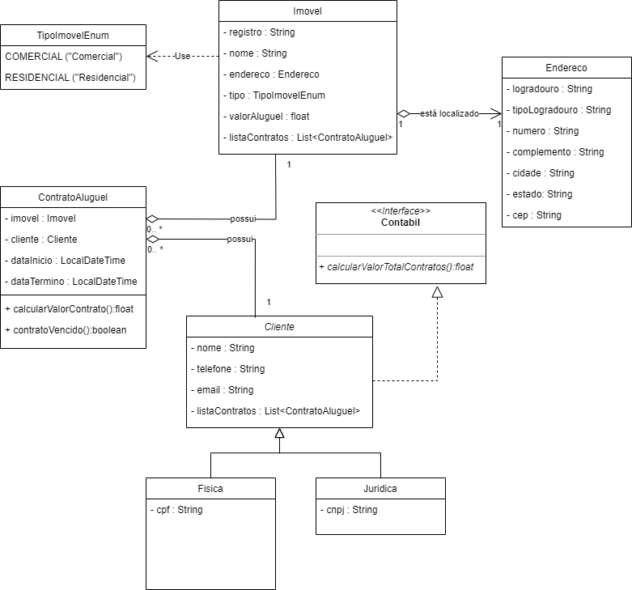

Em uma imobiliária é necessário controlar o cadastro dos clientes que podem ser pessoas físicas ou pessoas jurídicas que estão interessados em alugar um imóvel.

Os clientes da imobiliária possuem um nome, um telefone (com DDD) e um e-mail de contato. Os clientes do tipo pessoa física possuem um cpf; clientes do tipo pessoa jurídica possuem um cnpj.

Os imóveis que estão disponíveis podem ser comerciais ou residenciais e estão localizados em um endereço no Brasil. Cada imóvel tem um nome e seu próprio valor mensal de aluguel.

Quando um cliente deseja alugar um imóvel, é necessário estabelecer um contrato de aluguel. Em um contrato de aluguel, além do imovel a ser alugado e o cliente que irá alugar, é necessário definir a data de início e a data de término do contrato. Um cliente e um imóvel pode ter vários contratos de aluguéis. No entanto, um imóvel não pode estar em mais de um contrato que tenham períodos conflitantes (datas sobrepostas).

Cliente com 3 ou mais contratos tem 5% de desconto no valor total a ser pago. Cliente com 5 ou mais contratos tem 10% de desconto no valor total a ser pago.

O diagrama de classes a seguir modela parcialmente o sistema:

Agora, faça:

1 - A enumeração TipoImovelEnum;

2- A classe Endereco. Os atributos dessa classe precisam encapsulados e não podem ser nulos ou vazios;

3 - A classe Imovel. Os atributos registro e nome dessa classe precisam encapsulados e não podem ser nulos ou vazios. Os atributos endereco e tipo não podem ser nulos. O atributo valorAluguel não pode ser menor do que zero.

4 - A classe Cliente. Os atributos nome, telefone e email dessa classe precisam encapsulados e não podem ser nulos ou vazios.

5 - A classe Cliente deve implementar a Interface Contabil. O método calcularValorTotalContratos() deve realizar o somatorio de todos os valores dos contratos não vencidos que o 

6 - cliente está associado. Lembre-se da regra de negócio que considera um desconto de 5% ou 10% considerando o número de contratos.

7 - A classe Fisica e a classe Juridica. Os atributos dessas classes precisam ser encapsulados e não podem ser nulos ou vazios.

8 - A classe ContratoAluguel. Importante: não criar métodos setters para essa classe. Crie um contrutor para receber todos os parâmetros (imóvel, cliente, data de início e data de término). Os atributos imovel e cliente não podem ser nulos. Os atributos dataInicio e dataTermino não podem ser nulos e devem ter valores corretos. A data de término não pode ser inferior a data de início.

9 - Na classe ContratoAluguel implementar o método calcularValorContrato() que retorna o valor total do contrato. Ainda nessa classe, implementar o método contratoVencido() que retorna verdadeiro caso a data atual seja maior que a data de término. O método retorna falso caso contrário;

10 - Criar um método toString() na classe ContratoAluguel que formata uma string no formato CSV (comma separated value), com as seguintes informações: o registro do imovel, nome do imovel, endereco do imovel, valor do aluguel mensal do imovel, nome do cliente e telefone do cliente, data de início do contrato, data de término do contrato e a indicação se o contrato está vencido ou não;

11 - Crie classes de exceção para validação das regras relativas à classe Imovel;

12 - Crie classes de exceção para validação das regras relativas à classe Cliente;

13 - Crie classes de exceção para validação das regras relativas à classe ContratoAluguel;

14 - Criar uma classe Main com três listas: uma lista para os imóveis cadastrados; uma para os clientes cadastrados; e uma para os contratos de aluguéis;

15 - O programa deve fornecer um menu com diversas opções. Deve existir uma opção para o usuário terminar a execução do programa;

16 - O sistema deve oferecer uma opção para adicionar um cliente. O sistema deve solicitar ao usuário entrar com os dados;

17 - O sistema deve oferecer uma opção para adicionar um imóvel. O sistema deve solicitar ao usuário entrar com os dados;

18 - O sistema deve oferecer uma opção para adicionar um contrato de aluguel. O sistema deve solicitar ao usuário entrar com os dados. Informe o cpf ou cnpj e o registro do imóvel.

19 - O sistema deve oferecer uma opção para buscar um cliente pelo cpf ou pelo cnpj, apresentar os contratos de aluguéis (número de registro do imóvel, nome do imóvel, data de início e data de término, valor do contrato) e o valor total a ser pago por todos os contratos desse cliente;

20 - O sistema deve oferecer uma opção para buscar um imóvel por um número de registro e apresentar quantos contratos vigentes existentes;

21 - O sistema deve oferecer uma opção para exportar todos os contratos de aluguel em formato texto no padrão CSV (comma separated value). Utilizar o método toString() da classe ContratoAluguel;

CORINGA
Essa questão é opcional. Em caso de acerto, substituirá uma questão que o aluno errou. Caso o aluno acerte todas as questões anteriores, então acertar essa questão não fará diferença. Na hora de criar um contrato de aluguel, se certificar que não nenhuma sobreposição de intervalo de datas em diferentes contratos de aluguel para um mesmo imóvel.

Exemplo: considere dois contratos de aluguel para um mesmo imóvel:

Exemplo onde não há problema: 1- Data de início: 01/01/2020. Data de Término: 31/03/2020. 2- Data de início: 01/04/2020. Data de Término: 01/06/2020.

Exemplo onde existe problema: 1- Data de início: 01/01/2020. Data de Término: 31/03/2020. 2- Data de início: 01/02/2020. Data de Término: 01/06/2020.